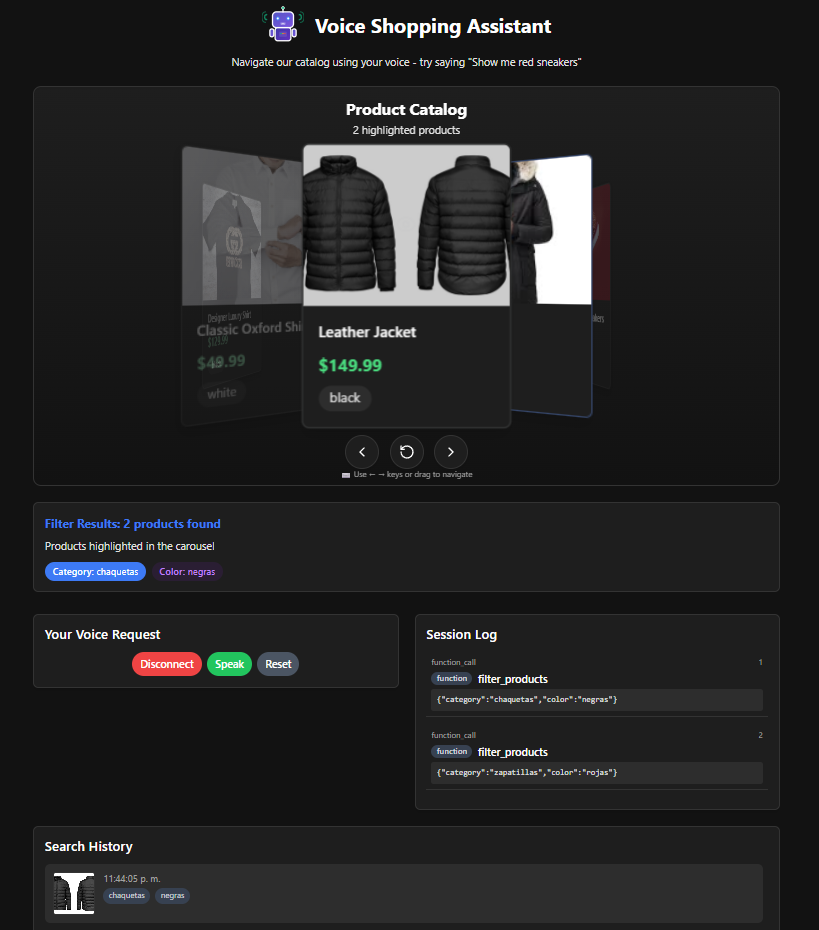

# Real-Time Voice-Powered E-commerce Agent



This project demonstrates a real-time voice-powered e-commerce agent using OpenAI's Realtime API with WebRTC. The application allows users to:

1. Capture voice from the user in real-time
2. Call a filter_products function based on detected voice commands
3. Display the function call results and relevant products
4. Save and manage query history for future reference

## Features

- **Real-time voice interaction** - Uses OpenAI's WebRTC implementation for voice processing
- **Function calling** - Detects product queries and extracts parameters (category, color, price)
- **Product display** - Shows matching products based on voice query

- **Session management** - Connect, disconnect, pause, and reset functionality

## Example Voice Flows

"Show me red sneakers under 100 dollars"
- Function call triggers filter_products with parameters
- UI displays matching red sneakers under $100
- Query is automatically saved to history

"Find blue shirts"
- Function call extracts category="shirts" and color="blue"
- UI displays matching blue shirts
- Search is added to query history for easy access

## Technology Stack

- **Frontend**: Next.js with React
- **Backend**: Next.js API routes
- **AI**: OpenAI Realtime API with `gpt-4o-realtime-preview-2024-12-17` model
- **Communication**: WebRTC for real-time audio streaming
- **Storage**: Local storage for query history persistence

## Requirements

- Node.js 18+
- OpenAI API key with access to the Realtime API

## Setup and Installation

1. Clone the repository
2. Install dependencies:
   ```
   npm install
   ```
3. Create a `.env.local` file in the root directory with your OpenAI API key:
   ```
   OPENAI_API_KEY=your_api_key_here
   ```
4. Run the development server:
   ```
   npm run dev
   ```
5. Open your browser to http://localhost:3000

## Usage Instructions

1. Click the "Connect" button to establish a session with OpenAI
2. When prompted, allow microphone access
3. Start speaking your product request (e.g., "Show me red sneakers under 100 dollars")
4. View the product results in real-time
5. Access your query history to revisit previous searches
6. Use the "Reset" button to clear the current search and start again
7. Click "Disconnect" when finished

## Project Structure

- `/components` - React components for the UI
- `/app/api/session` - API route for generating ephemeral session tokens
- `/lib` - Configuration and utility functions

## License

See the LICENSE file for details.
